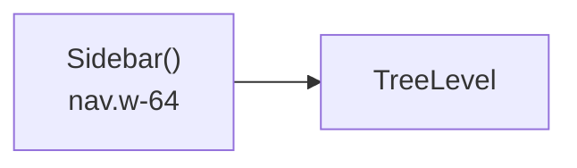
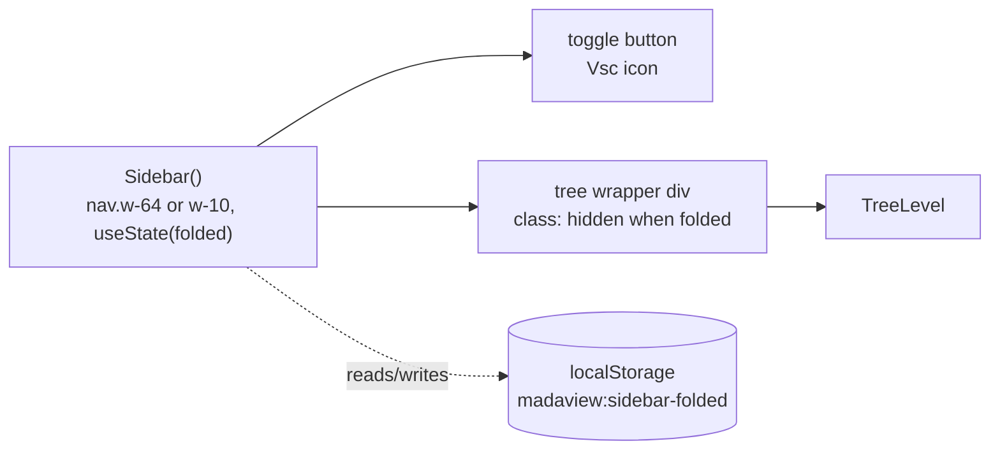

# ADR: Sidebar fold state + persistence

**Date:** 2026-07-16

## Context
`web/src/components/Sidebar.tsx` renders a fixed `w-64 <nav>` with no way to
collapse it. `.context/rdr/20260716-222037-sidebar-fold-unfold.md` commits
to a fold/unfold toggle: a 40px icon rail, tree always mounted and hidden
via CSS when folded, boolean state persisted to `localStorage`. `react-icons`
(`^5.7.0`) is already installed (`.context/adr/20260716-215527-react-icons.merged.md`),
so `VscLayoutSidebarLeft`/`VscLayoutSidebarLeftOff` are available to import.

This change touches one existing file and adds one e2e scenario. There is
no domain entity, no cross-object algorithm, and one consumer for the
persistence logic — Objects/Logics/Usecase/External layering does not
apply at this scale (same call made in the react-icons ADR); splitting a
~30-line addition into layers or a new module would be over-engineering
per `meta-pattern.md`'s ~100-line guidance.

## Decision

### Before

### After

All changes land in `web/src/components/Sidebar.tsx`:
- `getStoredFolded()` / `setStoredFolded(folded: boolean)` — two private,
  non-exported functions at the top of the file, same shape as
  `theme.ts`'s `getStoredTheme`/`applyTheme` but scoped locally (this
  feature has one consumer, unlike theme which is read at app boot and in
  `ThemePicker.tsx`). No try/catch, mirroring `theme.ts`. Stored value must
  equal the exact string `"true"` to resolve `folded = true`; anything else
  (missing key, `"false"`, garbage) resolves to `false`.
- `Sidebar()`: `const [folded, setFolded] = useState(() => getStoredFolded())`
  — lazy initializer reads `localStorage` synchronously during the first
  render, before first paint (this is a CSR-only Vite app, no SSR), so
  there is no flash of the wrong state.
- `toggle()`: flips `folded`, calls `setStoredFolded(next)` in the same
  handler — no separate effect needed.
- `<nav>` className switches between `w-64` and `w-10` (`p-3`/`p-1`
  likewise, so the rail isn't padded to hold empty tree space), plus
  `transition-[width] duration-200 ease-in-out` unconditionally.
- Toggle button renders at the top of `<nav>`, always in the same
  position; icon is `VscLayoutSidebarLeftOff` when folded, else
  `VscLayoutSidebarLeft`; `aria-label` is `"Expand sidebar"` /
  `"Collapse sidebar"` to match (also serves as the e2e selector).
- The existing `<TreeLevel path="" />` moves inside a wrapper `
` whose
  className includes `hidden` (Tailwind `display:none`) when `folded` is
  true — never unmounted, so `TreeNode`'s per-node `expanded` state
  survives a fold/unfold round-trip for free (identical mechanism to
  `tabs-and-split-view`'s pane-content visibility toggle).

## Observability
- `<nav data-testid="sidebar" data-folded={folded}>` and
  `<button data-testid="sidebar-toggle" aria-label={...}>` — `data-*` hooks
  for e2e assertions, matching the `data-pane-id`/`data-active` convention
  from `tabs-and-split-view`.
- Browser DevTools: `localStorage.getItem('madaview:sidebar-folded')`
  directly shows the persisted value at any time.
- No new console logging — a boolean UI toggle has no failure mode deep
  enough to warrant runtime logging beyond what React/DevTools already
  expose.

## Test-Loop Design
No existing scenario drives the sidebar toggle. New scenario
`e2e/sidebar-fold-unfold/` (`test`, `run`, `verify`, `data/`), reusing
`e2e/lib/harness.mjs` (`resetResultDir`, `startServer`, `writeMetadata`,
`writeJSON`, `readResultJSON`, `report`) and `e2e/lib/browser.mjs`
(`withPage`) — same shared helpers `theme-switching` uses, per
`test-loop.md`'s "reuse before creating."

- **`run`:** Reset `result/`. Start the server against a small fixture root
  (1-2 files, one nested folder to expand). Drive Playwright, writing
  `result/interaction.json` with a checkpoint after each step (`navWidth`,
  `navDataFolded`, computed `width`/`transition-duration` CSS, tree wrapper
  visibility, `localStorage['madaview:sidebar-folded']`, expanded-folder
  visible/hidden state, request count):
  1. Fresh load, no stored key → assert open (`w-64`), tree visible,
     `data-folded="false"`.
  2. Expand a folder in the tree → assert it's expanded.
  3. Click toggle → assert rail width (`w-10`), tree wrapper `hidden`,
     `data-folded="true"`, localStorage now `"true"`, computed transition
     duration is 200ms.
  4. Click toggle again (unfold) → assert open, tree visible, and the
     folder expanded in step 2 is still expanded (no new `/api/tree`
     request fired for it).
  5. Reload the page → assert it renders folded on first paint (state
     survived), no flash captured (check first computed style read, not
     just post-load).
  6. Set `localStorage['madaview:sidebar-folded']` to `"garbage"` via
     `page.evaluate`, reload → assert it renders open (fallback).
  Write `server.log`, `metadata.json` (scenario name, fixture root, port)
  alongside `interaction.json`.
- **`verify`:** Reads `interaction.json` and `metadata.json`; checks each
  checkpoint against its expected value above, reports good/unexpected/
  ambiguous with root cause from `server.log` for any unexpected request.
- **Scenario:** `sidebar-fold-unfold` → all 6 checkpoints pass.

Two-browser-tab-no-live-sync (RDR's Boundary AC) and the 200ms transition
timing are covered as manual verification only — no live cross-tab
messaging exists to assert against in a single-page Playwright session,
and transition duration is captured as a computed-style read in step 3
rather than a separate scenario.

## Verification Criteria
- Given a first-ever visit - When the app loads - Then the sidebar renders
  open at `w-64` (Normal — e2e checkpoint 1).
- Given the sidebar is open - When the toggle is clicked - Then it
  animates to `w-10`, the tree hides but stays mounted, and
  `localStorage['madaview:sidebar-folded']` becomes `"true"` (Normal — e2e
  checkpoint 3).
- Given a folder was expanded before folding - When the sidebar is folded
  then unfolded - Then that folder is still expanded, no re-fetch (Normal —
  e2e checkpoint 4).
- Given the sidebar is folded and persisted - When the page reloads - Then
  it renders folded on first paint, no flash of the open state (Normal —
  e2e checkpoint 5).
- Given `localStorage['madaview:sidebar-folded']` holds a value other than
  the exact string `"true"` - When the app loads - Then it renders open
  (Exception — e2e checkpoint 6).
- Given two browser tabs open, sidebar folded in one - When the other tab
  is not reloaded - Then it stays in its prior state (Boundary — manual
  two-tab check, not e2e-automated).
