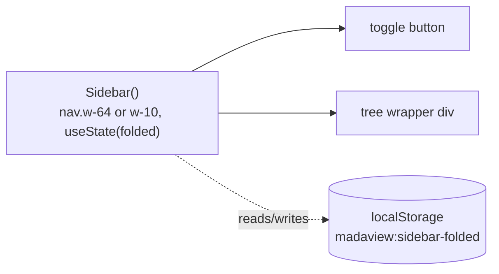
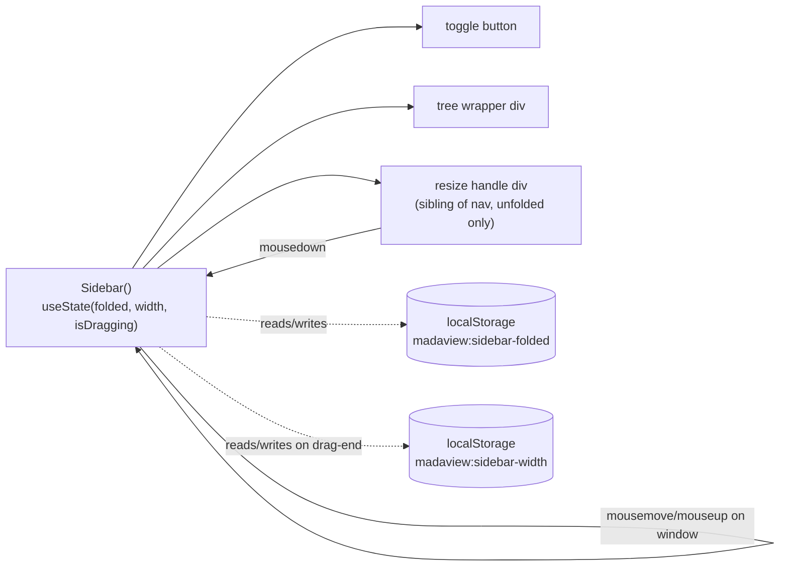

# ADR: Sidebar resize (drag-to-width)

**Date:** 2026-07-17

## Context
`web/src/components/Sidebar.tsx` has two fixed widths (`w-64`/`w-10`), no
value in between. `.context/rdr/20260717-152242-sidebar-resize.md` commits
to a drag-to-width handle: 180–600px bounds, default 256px, persisted to
`localStorage['madaview:sidebar-width']`, live-clamped during drag,
transition suppressed while dragging, mouse-only. `PaneDivider.tsx`
(`web/src/components/PaneDivider.tsx`) is the only existing drag affordance
in this app — absolute rect-relative calculation on every `mousemove`,
`mousedown`/`mousemove`/`mouseup` on `window`, `cursor-col-resize`.

This change touches one existing file (`Sidebar.tsx`) and adds one e2e
scenario. There is no domain entity, no algorithm spanning multiple
objects, and one consumer of the persistence logic —
Objects/Logics/Usecase/External layering does not apply at this scale
(same call made in `.context/adr/20260716-233115-sidebar-fold-unfold.merged.md`
for a similarly-sized change). Splitting a ~50-line addition into layers or
a new module would be over-engineering per `meta-pattern.md`'s
~100-line-before-decomposing guidance.

## Decision

### Before

### After

All changes land in `web/src/components/Sidebar.tsx`:
- `clampWidth(width: number): number` — private, non-exported;
  `Math.min(600, Math.max(180, width))`. Single source of truth for the
  bound, used both when reading the stored value and live during drag —
  no second clamp implementation to drift out of sync.
- `getStoredWidth(): number` — private. Reads
  `localStorage.getItem('madaview:sidebar-width')`. Missing key or
  `Number.isNaN(Number(value))` → returns the default, `256`. Otherwise
  returns `clampWidth(Number(value))` — a valid-but-out-of-range number
  clamps rather than falling back, per the RDR's Decision. No try/catch,
  matching `getStoredFolded`'s existing unguarded pattern in this file.
- `setStoredWidth(width: number): void` — private.
  `localStorage.setItem('madaview:sidebar-width', String(width))`. Called
  exactly once, from the `mouseup` handler — never from `mousemove`.
- `Sidebar()` adds two `useState` hooks: `const [width, setWidth] =
  useState(() => getStoredWidth())` (lazy initializer, same
  synchronous-before-first-paint pattern as `folded`) and `const
  [isDragging, setIsDragging] = useState(false)`. `isDragging` is
  `useState`, not a `useRef` like `PaneDivider`'s `draggingRef` — the RDR
  requires the transition class to reappear immediately on `mouseup` with
  no other interaction, which only a state-driven re-render guarantees;
  `PaneDivider` has no equivalent "restore a suppressed class exactly on
  release" requirement, so its ref-only pattern doesn't transfer here.
- `const navRef = useRef<HTMLElement>(null)` — new ref on `<nav>`, needed
  because width is computed from the nav's own bounding rect on every
  `mousemove` (`e.clientX - navRef.current.getBoundingClientRect().left`,
  then `clampWidth(...)`), mirroring `PaneDivider`'s
  `containerRef.current.getBoundingClientRect()` absolute, rect-relative
  calculation — recomputed fresh each move, so no drag-start delta state
  is needed and no drift can accumulate.
- `handleResizeStart(e: React.MouseEvent)`: `setIsDragging(true)`; attaches
  `mousemove`/`mouseup` listeners to `window` inside a `useEffect` gated on
  `isDragging` (mirrors `PaneDivider`'s `useEffect([handleMove,
  handleUp])`, adapted to only listen while a drag is in progress rather
  than for the component's whole lifetime, since this component has other
  reasons to re-render — fold toggling — that must not spuriously
  add/remove drag listeners).
- `mousemove` handler (active only while `isDragging`): computes the new
  width per the rect-relative formula above, calls `setWidth(clamped)`.
- `mouseup` handler (active only while `isDragging`): calls
  `setStoredWidth(width)` with the latest width, then `setIsDragging(false)`.
- `<nav>` gains `ref={navRef}` and, when unfolded, `style={{ width }}`
  instead of the `w-64` Tailwind class (folded still uses the fixed `w-10`
  class — unaffected by this change). The always-on
  `transition-[width] duration-200 ease-in-out` class becomes conditional:
  present when `!isDragging`, absent when `isDragging`, so drag tracks the
  cursor 1:1 while fold/unfold keeps its existing 200ms animation.
- `Sidebar()`'s return changes from a single `<nav>` to a Fragment: `<nav>`
  followed by a resize-handle `
`, rendered only when `!folded`. Both
  are flex siblings already inside `App.tsx`'s `
`, so the handle sits visually at the sidebar/content
  border with zero changes to `App.tsx`, mirroring how `PaneDivider` sits
  between `Workspace`'s two `Pane` divs.
- Resize-handle `
`: `data-testid="sidebar-resize-handle"`,
  `role="separator" aria-orientation="vertical"` (matching `PaneDivider`'s
  accessibility attributes), `className="w-1 shrink-0 cursor-col-resize
  bg-[var(--border)] hover:bg-[var(--accent)]"` (byte-for-byte the same
  Tailwind classes `PaneDivider` uses, per the RDR's visual-consistency
  requirement), `onMouseDown={handleResizeStart}`.

## Observability
- `<nav data-testid="sidebar" data-folded={folded}>` already exists;
  unchanged. `getComputedStyle(nav).width` is the existing/reused
  observation point for current width — no new `data-width` attribute
  needed since e2e already reads computed style for the fold-unfold
  scenario.
- `
` — the mousedown target for
  e2e's `page.mouse.move`/`down`/`up` simulation, and the element whose
  `getComputedStyle(...).cursor` an e2e check reads to confirm
  `col-resize`.
- `getComputedStyle(nav).transitionDuration` — reused checkpoint (same one
  the fold-unfold scenario already reads) to confirm the class is present
  post-drag and absent mid-drag.
- Browser DevTools: `localStorage.getItem('madaview:sidebar-width')`
  directly shows the persisted value at any time, same convention as
  `madaview:sidebar-folded`.
- No new console logging — a drag-to-width interaction has no failure mode
  deep enough to warrant runtime logging beyond what React DevTools and the
  e2e harness's `interaction.json` already expose (same call as the
  fold-unfold ADR).

## Test-Loop Design
No existing scenario simulates a mouse drag — `e2e/sidebar-fold-unfold`
only clicks a toggle button, `PaneDivider` has no e2e coverage at all. Per
`test-loop.md`'s "extend rather than create, but only when an existing
scenario covers the needed behaviors": neither does, so this is a new
scenario, `e2e/sidebar-resize/` (`test`, `run`, `verify`, `data/`), reusing
`e2e/lib/harness.mjs` (`resetResultDir`, `startServer`, `nextPort`,
`writeMetadata`, `writeJSON`, `readResultJSON`, `report`) and
`e2e/lib/browser.mjs` (`withPage`) — same shared helpers `sidebar-fold-unfold`
and `theme-switching` use.

- **`run`:** Reset `result/`. Start the server against a small fixture root
  (reuse `e2e/sidebar-fold-unfold/data/` layout — 1-2 files, one nested
  folder). Drive Playwright, writing `result/interaction.json` with a
  checkpoint after each step:
  1. Fresh load, no stored key → capture `initial`: `data-folded`,
     computed `width` (expect `256px`).
  2. `page.mouse.move` to the handle's center, `page.mouse.down()`, then a
     sequence of `page.mouse.move` calls tracing a path from the current
     handle X to a target corresponding to 400px → capture `midDrag`:
     computed `width`, computed `transitionDuration` (expect not present /
     `0s`), cursor style over the handle.
  3. Continue moving past the 600px-equivalent X and past the
     180px-equivalent X in two further sub-steps → capture
     `clampedAtMax`/`clampedAtMin`: computed `width` at each (expect never
     exceeds `600px` / never goes below `180px`).
  4. `page.mouse.up()` at a position corresponding to 400px → capture
     `afterDrag`: computed `width` (`400px`), computed `transitionDuration`
     (expect the 200ms value restored),
     `localStorage['madaview:sidebar-width']` (expect `"400"`), and a
     write-count captured via a `localStorage.setItem` call counter
     injected before the drag began (expect exactly 1 write across the
     whole drag).
  5. `page.reload()` → capture `afterReload`: computed `width` (expect
     `400px` on first paint).
  6. `page.evaluate` to set `localStorage['madaview:sidebar-width']` to
     `"abc"`, reload → capture `afterInvalid`: computed `width` (expect
     `256px`).
  7. `page.evaluate` to set it to `"900"`, reload → capture
     `afterOutOfRange`: computed `width` (expect `600px`).
  8. Click the fold toggle → capture `folded`: whether
     `[data-testid="sidebar-resize-handle"]` is present/visible (expect
     not). Click toggle again (unfold) → capture `unfolded`: computed
     `width` (expect back to `600px`, the last value from step 7 — same
     "restore at unfold" precedent as fold state), handle visible again.
  Write `server.log`, `metadata.json` alongside `interaction.json`.
- **`verify`:** Reads `interaction.json` and `metadata.json`; checks each
  checkpoint against its expected value above, reports good/unexpected/
  ambiguous with root cause from `server.log` for any unexpected request.
- **Scenario:** `sidebar-resize` → all 8 checkpoints pass.

## Verification Criteria
- Given a first-ever visit - When the app loads - Then the sidebar renders
  at `256px` (Boundary — e2e checkpoint 1).
- Given the sidebar is unfolded - When the handle is dragged to a point
  corresponding to 400px - Then width tracks the cursor 1:1 with no
  transition lag, settling at `400px` (Normal — e2e checkpoint 2/4).
- Given an active drag - When the cursor moves past either bound - Then
  the rendered width clamps at `600px`/`180px` and never visibly exceeds it
  (Boundary — e2e checkpoint 3).
- Given a drag ends - When `mouseup` fires - Then
  `localStorage['madaview:sidebar-width']` is written exactly once and the
  transition class is restored (Normal — e2e checkpoint 4).
- Given a persisted width - When the page reloads - Then it renders at that
  width on first paint (Normal — e2e checkpoint 5).
- Given a missing/non-numeric stored width - When the app loads - Then it
  renders at the default, `256px` (Exception — e2e checkpoint 6).
- Given a numeric stored width outside `[180, 600]` - When the app loads -
  Then it renders clamped into range, not the default (Exception — e2e
  checkpoint 7).
- Given the sidebar is folded - When inspected - Then no resize handle is
  present; unfolding restores the last custom width (Boundary — e2e
  checkpoint 8).
- Given the resize handle - When hovered - Then the computed cursor style
  is `col-resize` (Normal — e2e checkpoint 2, cursor capture).
