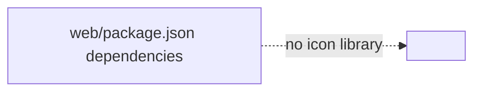
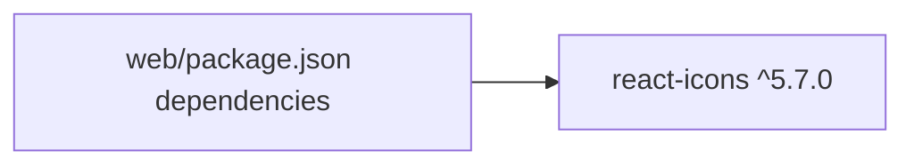

# ADR: Add react-icons dependency for VSCode-style icons

**Date:** 2026-07-16

## Context
`web/package.json` had no icon-library dependency. `.context/req/react-icons.md`
(via `.context/rdr/20260716-213757-react-icons.merged.md`) committed to
adding `react-icons` (the `vsc` codicon subset) so the already-agreed
`.context/intents/sidebar-folding.md` toggle icons (`VscLayoutSidebarLeft` /
`VscLayoutSidebarLeftOff`) can be built later. This ADR covers only the
dependency addition — no source file imports it yet, so there is no runtime
behavior, and no Objects/Logics/Usecase/External layers apply. Adding classes
or modules for a manifest-only change would be over-engineering at this scale.

## Decision

### Before

### After

Added `"react-icons": "^5.7.0"` to `web/package.json` `dependencies`, ran
`npm install` in `web/`, which updated `web/package-lock.json` with a single
new entry (`react-icons@5.7.0`, `peerDependencies: { react: "*" }`, no
transitive dependencies). No source file was touched — the convention
(per-icon named imports from a subset subpath, e.g. `react-icons/vsc`,
never the package root) applies to whichever future change first imports an
icon; it is documented here so that change follows it without re-deciding
it.

## Observability
- `npm ls react-icons` in `web/` reports the installed version and confirms
  no `UNMET PEER DEPENDENCY` / `invalid` entries. Confirmed:
  `react-icons@5.7.0`, clean.
- `git diff web/package.json web/package-lock.json` shows exactly one new
  dependency entry and its transitive lock entries — nothing else changes.
  Confirmed: `package.json` +1 line, `package-lock.json` +10 lines, both
  scoped to `react-icons` only.

## Test-Loop Design
No new or extended e2e scenario — there is no runtime behavior to exercise.
An unused dependency cannot fail `tsc -b`, `vite build`, or `oxlint`, so a
scenario asserting build/lint success here would pass trivially and prove
nothing. AC coverage for the import actually type-checking and tree-shaking
(the RDR's AC #2 and #4) is deferred to the sidebar-folding change that adds
the first real `react-icons/vsc` import — extend or add its test-loop
scenario there, not here.

## Verification Criteria
- Given `web/package.json` has no `react-icons` entry - When it is added as
  `^5.7.0` and `npm install` runs in `web/` - Then `package-lock.json`
  updates, `node_modules/react-icons` exists, and `npm install` prints no
  peer-dependency conflict (Normal). **Result: passed.**
- Given the dependency is added with no code referencing it - When
  `npm run build` and `npm run lint` run in `web/` - Then both succeed
  unchanged from their pre-change baseline, since nothing imports the new
  package yet (Normal). **Result: passed.** `npm run build` succeeded
  cleanly (only a pre-existing, unrelated chunk-size warning). The
  `npm run lint` wrapper script hit an unrelated harness hook artifact
  (`rtk hook claude` failing to parse oxlint's plain-text output as JSON);
  isolated by running `npx oxlint` directly — exit 0, zero issues.
- Exception/Boundary: not applicable at this scope — a manifest-only change
  has no failure or edge-case paths to test until an import exists; those
  become relevant in the sidebar-folding ADR that adds one.
