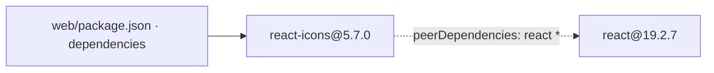
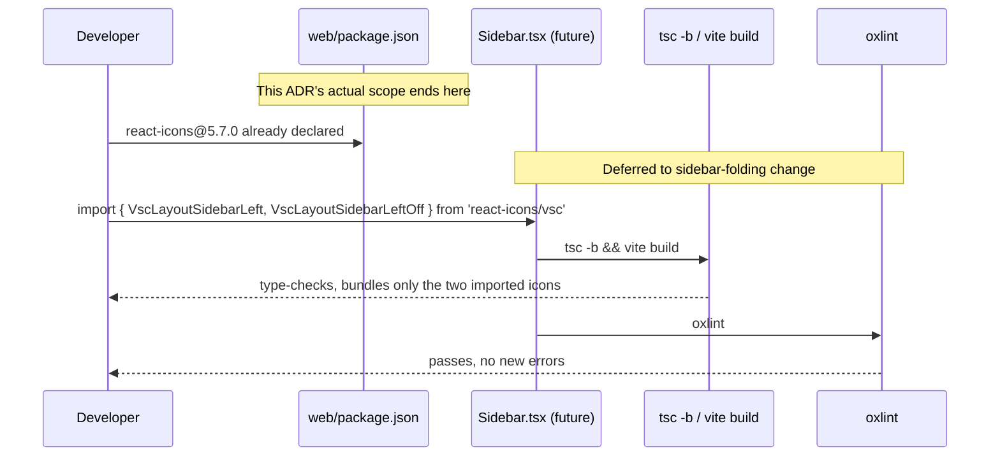

# Architecture: Add react-icons dependency for VSCode-style icons

**ADR:** `.context/adr/react-icons.md`

## Static View
> This change is manifest-only — no classes, no Objects/Logics/Usecase/External layers, no directory structure change. The only artifact is a dependency declaration.

**Directory structure**
```
web/
  package.json        # +1 line: "react-icons": "^5.7.0" in dependencies
  package-lock.json    # +10 lines: react-icons@5.7.0 lock entry, no transitive deps
```

**Classes**
None. No source file imports `react-icons` yet.

**Dependencies**


## Dynamic View
> The requirements spec's User Scenario ("Developer implements the sidebar toggle") describes future usage of this dependency, not code delivered by this change. This change stops at making the package installable; the import/build/lint flow below has not run against real code yet — it is the contract the sidebar-folding change must satisfy.

### Developer implements the sidebar toggle (not yet implemented — contract only)

