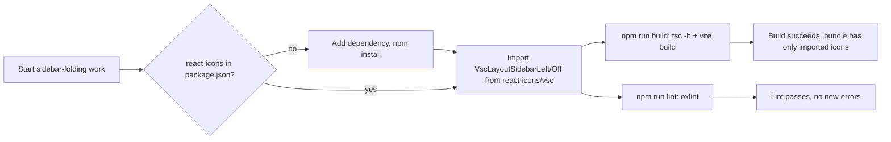

# SPEC - Add react-icons dependency for VSCode-style icons

## Context
`web/package.json` has no icon-library dependency today — the tree view in
`web/src/components/Sidebar.tsx` uses plain unicode chevrons (`▾`/`▸`) and
no file-type icons at all. The `.context/intents/sidebar-folding.md` design
(agreed via `/grilling`, not yet implemented) already picked
`react-icons/vsc` — `VscLayoutSidebarLeft` / `VscLayoutSidebarLeftOff` — for
the fold/unfold toggle, explicitly rejecting plain unicode glyphs in favor
of a proper icon library. This spec covers only adding that dependency and
the import convention so that implementation can proceed; it does not
implement the toggle itself.

## Requirements
- `react-icons` must be added to `web/package.json` `dependencies`.
- Icons must be imported per-icon from a subset subpath (e.g.
  `import { VscLayoutSidebarLeft } from 'react-icons/vsc'`), never from the
  package root — this is what makes Vite/Rollup tree-shake unused icons out
  of the bundle.
- The added dependency must not break the existing build (`tsc -b && vite
  build`) or lint (`oxlint`) commands in `web/`.
- The installed version must have no peer-dependency conflict with the
  project's `react@^19.2.7` / `react-dom@^19.2.7`.

## Decision
- Library: `react-icons`, icon set: `vsc` subset (codicons, matching
  VSCode's own iconography) — inherited from the already-agreed
  `sidebar-folding.md` decision; not re-litigated here.
- Version: `^5.7.0` (latest on npm as of this spec). `react-icons`
  declares `peerDependencies: { react: "*" }`, so it has no version
  conflict with React 19.
- Import style: named per-icon imports from the subset subpath (e.g.
  `react-icons/vsc`), not the package barrel — keeps unused icons out of
  the production bundle.

## Out of Scope
- File-type/folder icons in the tree view — current plain-text tree
  entries are untouched by this spec. Explicitly deferred; may become its
  own future RDR if adopted later.
- Building the sidebar fold/unfold toggle itself, its state, persistence,
  or CSS transition — all covered by `.context/intents/sidebar-folding.md`
  and out of scope here.
- Adopting other `react-icons` subsets (e.g. `fa`, `md`) — only `vsc` is in
  scope, matching the one existing decision that motivated this dependency.

# User Scenario

## Developer implements the sidebar toggle
Developer starts sidebar-folding implementation → needs `VscLayoutSidebarLeft`
/ `VscLayoutSidebarLeftOff` → dependency isn't present → adds `react-icons`
to `web/package.json` and installs → imports the two icons from
`react-icons/vsc` in `Sidebar.tsx` → build and lint both pass → bundle
contains only the two imported icons, not the full icon set.

# Acceptance Criteria

|AC|Category|Verification Method|
|--|--|--|
|Given `web/package.json` has no `react-icons` entry - When it is added as a dependency and `npm install` is run in `web/` - Then `node_modules/react-icons` exists and `npm install` completes with no peer-dependency conflict warnings|Normal|manual test: `npm install` output in `web/`|
|Given `react-icons` is installed - When a component adds `import { VscLayoutSidebarLeft } from 'react-icons/vsc'` - Then `npm run build` (`tsc -b && vite build`) succeeds with no type errors|Normal|manual test / build: `npm run build` in `web/`|
|Given `react-icons` is installed and imported - When `npm run lint` runs - Then it passes with zero new `oxlint` errors|Normal|manual test: `npm run lint` in `web/`|
|Given a component imports only `VscLayoutSidebarLeft` and `VscLayoutSidebarLeftOff` from `react-icons/vsc` - When the production bundle is built - Then the built output does not include unrelated icon sets (e.g. no `fa`/`md` icon glyphs bundled)|Boundary|manual test: inspect `vite build` output/bundle for absence of unused icon-set strings|
|Given the package root is imported instead of a subset subpath (e.g. `from 'react-icons'`) - When code review or lint checks the import - Then it is flagged/corrected before merge, since it would defeat tree-shaking|Exception|manual test: code review of the import statement|
