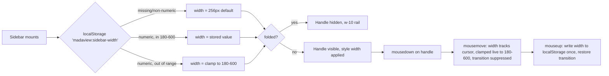

# SPEC - Sidebar resize (drag-to-width)

## Context
`web/src/components/Sidebar.tsx` has two fixed widths: `w-64` (256px) open,
`w-10` (40px) folded via the toggle button
(`.context/req/sidebar-fold-unfold.md`). There is no way to choose a width
in between. `web/src/components/PaneDivider.tsx` already implements a
draggable divider for the split-view feature — ratio-based (0–1), clamped
live to 0.15–0.85 of a flex container via `Math.min`/`Math.max` on every
`mousemove`, `mousedown`/`mousemove`/`mouseup` on `window`,
`cursor-col-resize` styling, no persistence. Neither `PaneDivider` nor any
other element in this app is drag-tested by an e2e scenario today —
`e2e/tabs-and-split-view` exercises pane state but never simulates a mouse
drag.

A `/grilling` round already agreed the design, captured in
`.context/intents/sidebar-resize.md`: persist to
`localStorage['madaview:sidebar-width']`, bounds 180–600px (default 256px),
standalone drag-handle logic in `Sidebar.tsx` (not a generalized
`PaneDivider`), handle hidden/inactive while folded, no snap-to-fold,
transition suppressed during drag, width applied via inline `style`, write
to `localStorage` only on drag-end, mouse-only (no keyboard/touch/
double-click). This spec resolves the remaining implementation-level
details needed to make the feature testable: live-clamp behavior during
drag, the handle's visual-consistency requirement against `PaneDivider`,
the accepted stuck-drag edge case, and each acceptance criterion's
verification method.

## Requirements
- The sidebar's width, while unfolded, must be resizable by dragging a
  handle on its trailing edge.
- During an active drag, the sidebar's right edge must track the cursor's
  horizontal position 1:1 — no acceleration, easing, or lag.
- During an active drag, width must clamp live to [180, 600]px as the
  cursor crosses either bound — it must never visually render outside that
  range mid-drag, matching `PaneDivider`'s live-clamp precedent.
- The resize handle must use `cursor-col-resize` on hover and the same
  visual affordance language as `PaneDivider` (thin bar, border-color at
  rest, accent-color on hover) — one consistent "draggable edge" visual
  convention across the app.
- The resize handle must be hidden and inert while the sidebar is folded —
  no drag possible, matching the folded rail's icon-only, toggle-only
  design.
- The `transition-[width] duration-200` class must be suppressed while a
  drag is active, so width tracks the cursor without a 200ms visual lag,
  and must be restored once the drag ends.
- The resolved width must be written to `localStorage['madaview:sidebar-width']`
  exactly once per drag, on `mouseup` — never on intermediate `mousemove`
  events.
- On mount, a missing or non-numeric stored width must resolve to the
  default, 256px.
- On mount, a numeric stored width outside [180, 600] must clamp into that
  range rather than falling back to the default.
- A first-ever visit (no stored key) must render the sidebar at 256px.
- No keyboard shortcut, touch/pointer-event support, or double-click reset
  is wired to the handle.
- No snap-to-fold behavior when dragged to the minimum width — resize and
  fold remain independent, explicit actions.

## Decision
- **Live-clamp during drag, not overshoot-then-snap.** Matches
  `PaneDivider`'s existing `Math.min`/`Math.max`-on-every-`mousemove`
  precedent, so the two drag affordances in this app behave identically at
  the bound, rather than establishing a second, inconsistent clamp
  behavior.
- **Handle must visually match `PaneDivider`'s style contract**
  (`cursor-col-resize`, thin bar, border/accent hover), not left fully open
  to `/archi`. The app has exactly one other draggable-edge affordance
  today; a second one with different visual language would read as
  inconsistent rather than as a deliberate design choice.
- **Stuck-drag-if-mouseup-fires-outside-the-window is an accepted, explicit
  out-of-scope limitation**, not a defect to fix. `PaneDivider` has this
  exact limitation today and no element in this app uses pointer capture or
  a window-blur listener; fixing it only for the sidebar handle would
  introduce a new robustness bar this feature alone has to clear, with no
  precedent to reuse.
- **The drag mechanics themselves are e2e-automated**, using Playwright's
  `page.mouse.move`/`down`/`up`, rather than left to manual verification.
  This is new ground for this repo's e2e suite (no prior scenario drags
  anything), but Playwright supports it natively — a one-time investment
  that covers the feature's core interaction directly, not just its
  persisted side effects. Matches this repo's existing "e2e-only, no unit
  framework" testing convention
  (`web/package.json` has no jest/vitest).
- **Invalid vs. out-of-bounds stored width are distinct fallback paths.**
  Missing/non-numeric → default (256px); numeric-but-out-of-range → clamp
  into [180, 600]. Carried forward from the intent: a still-usable
  out-of-range value (e.g. from a since-lowered max) shouldn't collapse to
  the same handling as outright garbage.

## Out of Scope
- Keyboard-driven resize (arrow keys on the handle).
- Touch/pointer-event support.
- Double-click-to-reset-to-default.
- Snap-to-fold when dragged to the minimum width.
- Cross-browser-tab live sync of width (no `storage` event listener, same
  as fold state).
- Generalizing `PaneDivider` into a shared ratio-or-pixel drag primitive.
- Fixing the stuck-drag case when the mouse button is released outside the
  browser window — accepted as a known limitation shared with
  `PaneDivider`.
- Any minimum hit-area larger than the handle's visual thickness — matches
  `PaneDivider`, which has none.

# User Scenario

## Drag to resize, reload
User opens the app for the first time (no `madaview:sidebar-width` key) →
sidebar renders at 256px → user presses down on the trailing-edge handle
and drags right → width tracks the cursor 1:1, no transition lag → user
drags past 600px → width visually clamps at 600px, does not overshoot →
user releases the mouse → `localStorage['madaview:sidebar-width']` is
written once, `"600"` → user reloads the page → sidebar renders at 600px
immediately on mount.

## Invalid or out-of-bounds stored value
User's `madaview:sidebar-width` is deleted, or manually set to a
non-numeric string via devtools → app loads → value fails the numeric
check → sidebar renders at the default, 256px. Separately, if the stored
value is a valid number outside [180, 600] (e.g. `"900"`, from a
since-lowered max) → app loads → value clamps into range → sidebar renders
at 600px, not the default.

## Fold hides the handle
Sidebar is unfolded with a custom width set → user clicks the fold toggle →
sidebar collapses to the 40px rail → the resize handle is not rendered (or
is inert) → user cannot drag while folded → user unfolds → sidebar returns
to its last custom width, handle reappears and is draggable again.

# Acceptance Criteria

|AC|Category|Verification Method|
|--|--|--|
|Given a first-ever visit with no `madaview:sidebar-width` key - When the app loads - Then the sidebar renders at 256px|Boundary|e2e test: `e2e/sidebar-resize`|
|Given the sidebar is unfolded at 256px - When the user drags the handle right to a point corresponding to 400px - Then the width tracks the cursor and settles at 400px, with no visible transition lag|Normal|e2e test: `e2e/sidebar-resize` (`page.mouse.move`/`down`/`up`)|
|Given an active drag - When the cursor moves past the 600px bound - Then the rendered width clamps at 600px and does not visually exceed it|Boundary|e2e test: `e2e/sidebar-resize`|
|Given an active drag - When the cursor moves past the 180px bound - Then the rendered width clamps at 180px and does not visually go below it|Boundary|e2e test: `e2e/sidebar-resize`|
|Given a drag ends at 400px - When `mouseup` fires - Then `localStorage['madaview:sidebar-width']` is written exactly once, to `"400"`, with no writes during the preceding `mousemove` events|Normal|e2e test: `e2e/sidebar-resize` (count writes via injected `localStorage.setItem` spy or before/after value diffing)|
|Given `localStorage['madaview:sidebar-width']` is `"400"` - When the page reloads - Then the sidebar renders at 400px on first paint|Normal|e2e test: `e2e/sidebar-resize`|
|Given `localStorage['madaview:sidebar-width']` is missing or a non-numeric string (e.g. `"abc"`) - When the app loads - Then the sidebar renders at the default, 256px|Exception|e2e test: `e2e/sidebar-resize`|
|Given `localStorage['madaview:sidebar-width']` is a numeric value outside [180, 600] (e.g. `"900"` or `"50"`) - When the app loads - Then the sidebar renders clamped into range (600px or 180px respectively), not the default|Exception|e2e test: `e2e/sidebar-resize`|
|Given the sidebar is folded - When the user inspects the trailing edge - Then no resize handle is rendered or it is inert, and no drag is possible|Boundary|e2e test: `e2e/sidebar-resize`|
|Given the sidebar has a custom width set before folding - When the user folds then unfolds - Then the sidebar returns to that same custom width|Normal|e2e test: `e2e/sidebar-resize`|
|Given the resize handle - When the cursor hovers over it - Then the computed cursor style is `col-resize`|Normal|e2e test: `e2e/sidebar-resize` (`getComputedStyle`)|
|Given a drag is active - When width changes - Then the `transition-[width] duration-200` class is absent from the `<nav>` element during the drag and present again after `mouseup`|Normal|e2e test: `e2e/sidebar-resize` (computed `transition-duration` mid-drag vs. post-drag)|
