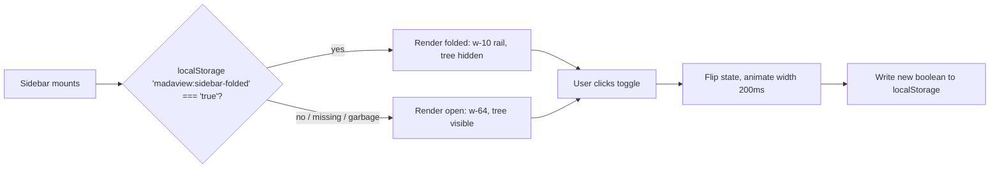

# SPEC - Sidebar fold state + persistence for restore at unfold

## Context
`web/src/components/Sidebar.tsx` renders a fixed-width (`w-64`) file-tree
`<nav>` with no way to collapse it. Users need the horizontal space back for
the workspace panes without losing their place in the tree. A prior
`/grilling` round already agreed the visual/interaction design, captured in
`.context/intents/sidebar-folding.md`. This spec adds the fold/unfold toggle's
state and its persistence so the fold choice survives a page reload, and
confirms the remaining implementation-level details (storage key, fallback
behavior, cross-tab scope, transition timing) needed to make it testable.

`react-icons` (the `vsc` subset, for the toggle icon) was added per
`.context/adr/20260716-215527-react-icons.md`.

## Requirements
- The sidebar must collapse to a 2.5rem/40px (`w-10`) icon-only rail
  showing only the toggle button, and expand back to `w-64` on toggle.
- The toggle button must render at the top of the `<nav>`, in the same
  relative position in both folded and unfolded states.
- The toggle icon must be `VscLayoutSidebarLeft` (unfolded) /
  `VscLayoutSidebarLeftOff` (folded) from `react-icons/vsc`.
- The width change must animate via CSS `transition` on `width`, 200ms
  `ease-in-out`.
- The tree (`TreeLevel`/`TreeNode`) must stay mounted at all times; folding
  must hide it via CSS only, never unmount it.
- Fold state must live in local `useState` inside `Sidebar.tsx` — no
  context, no lifting to `App.tsx`.
- Fold state must persist to `localStorage` under key
  `madaview:sidebar-folded` and be read back on mount.
- A stored value that is not the exact string `"true"` (missing key,
  `"false"`, corrupted/garbage value) must resolve to folded = `false`
  (open).
- First-ever visit (no stored key) must default to open (unfolded).
- `localStorage.getItem`/`setItem` calls must not be wrapped in try/catch —
  matches `theme.ts`'s existing, unguarded pattern.
- No keyboard shortcut is wired to the toggle.
- No cross-browser-tab live sync — a fold/unfold in one browser tab has no
  effect on another already-open tab until that tab reloads.

## Decision
- **Restore scope is the fold boolean only.** Tree expand-state surviving a
  fold/unfold round-trip comes for free from "tree stays mounted" and needs
  no extra persistence; it is not preserved across a full page reload, and
  scroll position is not persisted at all. Chosen to keep this spec's
  surface area to exactly what "restore at unfold" requires — the boolean —
  rather than expanding into a broader tree-state-persistence feature.
- **No try/catch around localStorage calls.** `theme.ts` already reads/writes
  localStorage unguarded; adding defensive error handling here would be a
  new convention inconsistent with the rest of the app, for a failure mode
  (localStorage disabled/throwing) that already exists as a pre-existing
  risk on every page load via theme loading.
- **No cross-browser-tab sync.** Matches `theme.ts`, which does not
  broadcast theme changes via the `storage` event either. Avoids
  introducing a new sync mechanism for a low-value edge case.
- **200ms ease-in-out transition**, the upper bound of the
  previously-agreed "~150-200ms" range and the first CSS transition in this
  codebase — picked over inventing a new duration convention.

## Out of Scope
- Adding the `react-icons` dependency — covered by `.context/adr/20260716-215527-react-icons.md`.
- Persisting tree expand-state or scroll position across a page reload —
  only the fold/unfold boolean is persisted.
- Cross-browser-tab live sync via the `storage` event.
- Any keyboard shortcut for toggling.
- Fully hidden sidebar (width 0) or a rail showing folder icons — rejected
  in `.context/intents/sidebar-folding.md`, not re-litigated here.

# User Scenario

## First visit, fold, reload
User opens the app for the first time (no `madaview:sidebar-folded` key) →
sidebar renders open at `w-64` → user clicks the toggle → sidebar animates
to the 40px rail over 200ms, tree hidden but still mounted →
`madaview:sidebar-folded` is set to `"true"` → user reloads the page →
sidebar renders folded (rail) immediately on mount, no flash of the open
state.

## Corrupted or missing stored value
User's `madaview:sidebar-folded` value is deleted, or manually set to
`"1"`/garbage by devtools → user loads the app → value fails the exact
`"true"` string check → sidebar renders open (default), same as first
visit.

# Acceptance Criteria

|AC|Category|Verification Method|
|--|--|--|
|Given the sidebar is open at `w-64` - When the user clicks the toggle - Then it animates to the 40px rail, the tree is hidden but remains mounted, and `localStorage['madaview:sidebar-folded']` becomes `"true"`|Normal|e2e test: `e2e/sidebar-fold-unfold`|
|Given the sidebar is folded and `localStorage['madaview:sidebar-folded'] === "true"` - When the page is reloaded - Then the sidebar renders folded on first paint with no visible flash of the open state|Normal|e2e test: `e2e/sidebar-fold-unfold`|
|Given the tree had an expanded folder before folding - When the user folds then unfolds the sidebar - Then that folder is still expanded, with no re-fetch of its directory listing|Normal|e2e test: `e2e/sidebar-fold-unfold`|
|Given a first-ever visit with no `madaview:sidebar-folded` key in localStorage - When the app loads - Then the sidebar renders open (`w-64`)|Boundary|e2e test: `e2e/sidebar-fold-unfold`|
|Given `localStorage['madaview:sidebar-folded']` is set to a value other than the exact string `"true"` (e.g. `"false"`, `"1"`, empty string) - When the app loads - Then the sidebar renders open (`w-64`)|Exception|unit test or e2e test: `e2e/sidebar-fold-unfold`|
|Given two browser tabs open to the app, both showing the sidebar open - When the sidebar is folded in tab A - Then tab B's sidebar remains open until tab B is reloaded|Boundary|manual test: two-tab reload check|
|Given the sidebar toggle is clicked - When the width transitions - Then the CSS transition duration is 200ms with `ease-in-out` timing|Normal|manual test: inspect computed style / `e2e/sidebar-fold-unfold` computed-styles capture|
